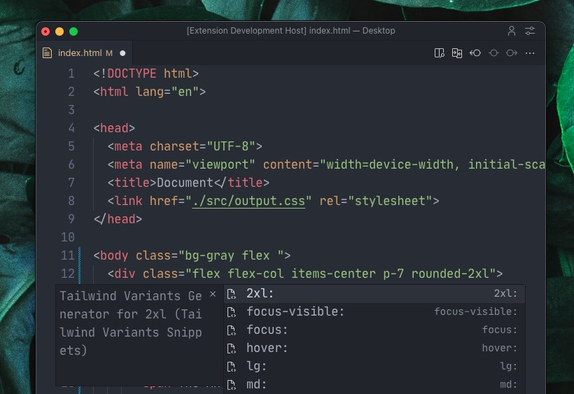

# Tailwind Variants Snippets

A collection of very powerful VS Code snippets to write super fast breakpoint variants and other common modifiers. This extension automatically picks up the last typed utility class and allow you to only write the changing value.

For example after typing `bg-red-500 hover:` it will add the `bg-red-` prefix for you to quickly add a hover variant. It lets you write Tailwind CSS really fast.



It also supports custom values, for example after typing `pt-[24px] md:` it will automatically populate the utility class and the unit inside the square brackets, like this: `pt-[px]` with the cursor position already inside the square brackets.

## Features

- Support for responsive, state, and modifier variants
- Support for custom values
- Support for tailwind v4 custom property. Eg: `bg-(--color-primary)`

## Installation

1. Open VS Code
2. Go to the Extensions view (Ctrl+Shift+X or Cmd+Shift+X)
3. Search for "Tailwind Variants Snippets"
4. Click Install

## Usage

Type the snippet prefix in your code and press Tab or Enter to expand the snippet. The snippets will appear in the suggestion list as you type.

## Recommended VS Code Settings

To get the best experience with these snippets, we recommend adding the following settings to your VS Code settings.json:

```json
{
  "editor.suggest.showSnippets": true,
  "editor.snippetSuggestions": "top",
  "editor.suggestOnTriggerCharacters": true,
  "editor.quickSuggestions": {
    "other": true,
    "comments": true,
    "strings": true
  }
}
```

These settings will:
- Always show snippets in the suggestion list
- Prioritize snippets at the top of the suggestion list
- Show suggestions when typing trigger characters
- Enable quick suggestions in various contexts

## Contributing

Contributions are welcome! Please feel free to submit a Pull Request.

## License

This project is licensed under the MIT License - see the LICENSE file for details.